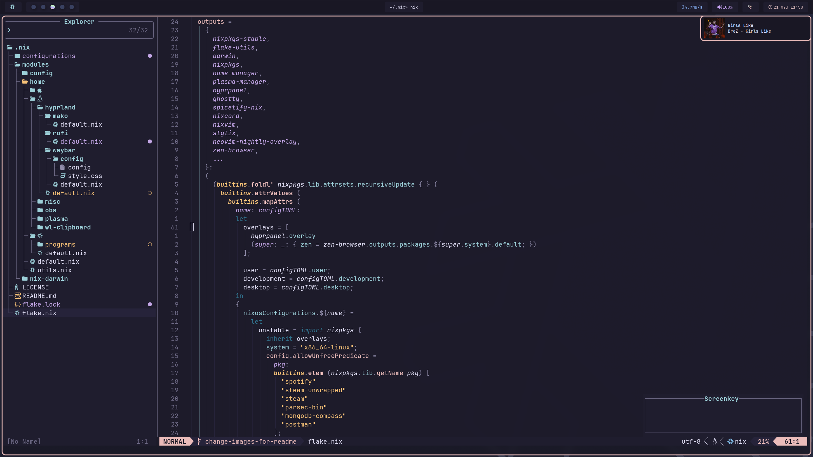

= Invra's Nix Configuration

This Nix flake is your all-in-one system configuration toolkit. It provides:

* Home-manager configuration
* NixOS configuration

---

== Features
.Simple to change configurations
[%collapsible%open]
====
* Using the flake you can configure your system
* Have Quick settings
* Git and Mercurial common settings editable in one file
====

.Out-of-box configs
[%collapsible]
====
* Rose-pine rice
* Vencord pre-configured for better stuff
* Lower chance for PulseAudio to destroy your ears.
* macOS workflow fixers
** Linear Mouse
** AeroSpace
====

.Customisable networking
[%collapsible]
====
* Disable NetworkManager
* Enable Bridging to let VM's allow your whole network
====

.Music Production & Pro Audio
[%collapsible]
====
* JACK2
* Bitwig Studio
* VST Support (theoretically)
====

.Multimedia
[%collapsible]
====
* Zen Browser
* Chromium
* OBS Studio
* V4l2loopback
* yt-dlp
* Discord (or Vesktop on aarch64-linux)
====

.Terminal-based workflows
[%collapsible]
====
* Git
* gh (GitHub CLI)
* glab (Gitlab CLI)
* btop
====
---

== Examples

.NixOS – Spotify + WezTerm + Hyprland
[%collapsible%open]
====
image::./.res/demo_1.png[Demo 1]
====

.NixOS – Vesktop + Browsing + PiP
[%collapsible]
====
image::./.res/demo_3.png[Demo 3]
====

.NixOS – Neovim + Mako
[%collapsible]
====

====

---

== Documentation
You can find the docs
link:https://gitlab.com/invra/nix-conf/-/wikis/home[here].

---

== Contribution

Check out the link:./CONTRIBUTING.adoc[Contributions write-up] and link:./TODO.org[Todo-list]
