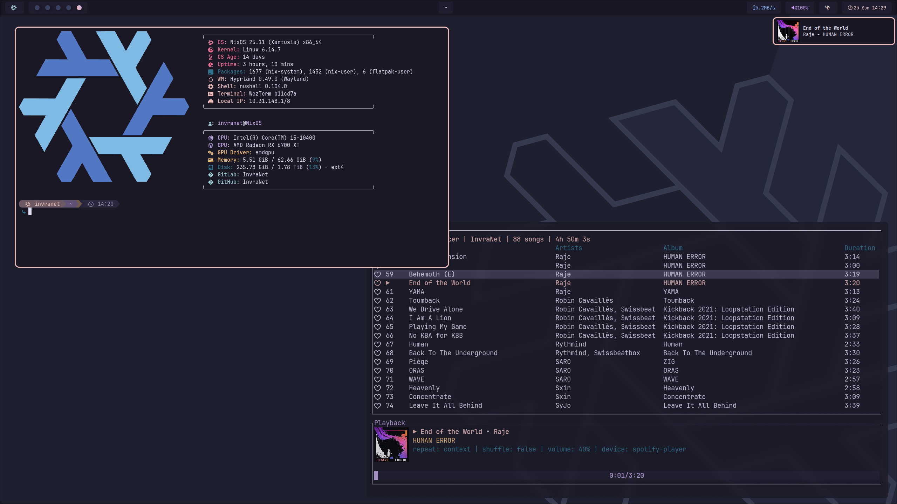

= INF (Invra's Nix Flake) Configuration Template

This Nix flake provides the following:

* *Home-manager config*
* *NixOS config*
* *Nix-darwin config*

== Key Features

* *Advanced networking for virtualization* (Bridging)
* *Pro audio* (JACK2 with OOB support for Bitwig Studio)
* *Terminal-based work*:
** helix
** spotify_player
** git, gh, glab
** btop
* *Multimedia*:
** zen-browser
** chromium
** OBS Studio
** yt-dlp
** discord (*vesktop for linux-aarch64*)
* *Remote software*:
** Parsec
** Wayvnc
* *OOB Configurations*:
** Rose-pine theme for congruency
** Discord settings for optimal + sensical usage
** Lower chance of PulseAudio to earrape you
** (Mac) Apps installed to make _"the Mac experience"_ make more sense:
*** Linear Mouse
*** Raycast
*** AeroSpace

== Supported Platforms

This flake can usually *guarantee* support for the following platforms:

* aarch64-linux
* x86_64-linux
* aarch64-darwin

== Examples

.NixOS – Spotify + WezTerm + Hyprland
[%collapsible%open]
====

====

.Nix-darwin – YouTube Music (Zen Browser) + Ghostty
[%collapsible]
====
image::./.res/demo_2.png[Demo 2]
====

.NixOS – Vesktop + Browsing + PiP
[%collapsible]
====
image::./.res/demo_3.png[Demo 3]
====

.Nix-darwin – Rust Dev - Helix + Browsing + PiP
[%collapsible]
====
image::./.res/demo_4.png[Demo 4]
====

.NixOS – Neovim + Mako
[%collapsible]
====
image::./.res/demo_5.png[Demo 5]
====

== Documentation

The full documentation has been replaced in favor of GitLab Wikis.
It is available with link:https://gitlab.com/invra/nix-conf/-/wikis/home[this link].
