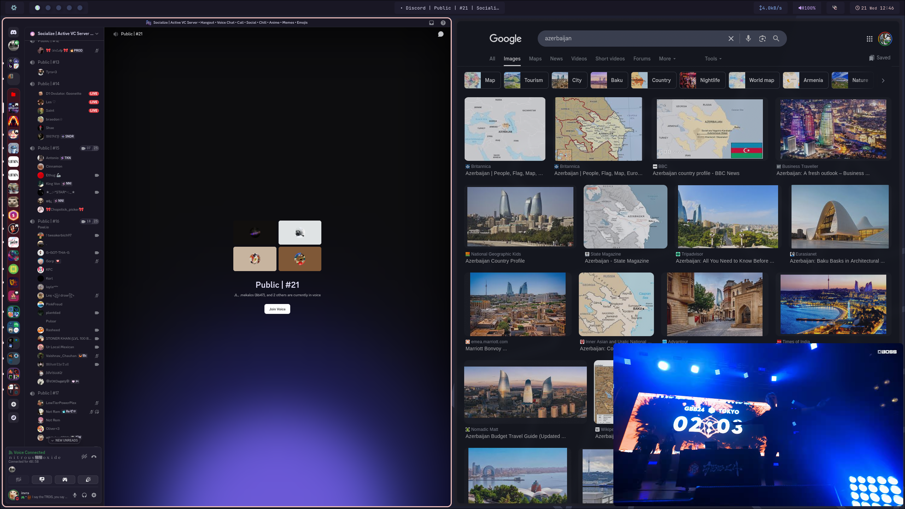

= Invra's Nix Configuration

This Nix flake is all-in-one. It provides:

* Home-manager configuration
* NixOS configuration

---

== Features

.Out-of-box configs
[%collapsible]
====
* Rose-pine rice
* Vencord pre-configured for better stuff
====

.Music Production & Pro Audio
[%collapsible]
====
* JACK2
* Bitwig Studio
* VST Support (theoretical, still needs testing)
====

.Multimedia
[%collapsible]
====
* Firefox
* OBS Studio
* yt-dlp
* Discord (or Vesktop on aarch64-linux)
====

.Terminal-based workflows
[%collapsible]
====
* Git
* gh (GitHub CLI)
* glab (Gitlab CLI)
* btop
====
---

== Examples

.NixOS – Spotify + WezTerm + Hyprland
[%collapsible%open]
====
image::./.res/demo_1.png[Demo 1]
====

.NixOS – Vesktop + Browsing + PiP
[%collapsible]
====

====

.NixOS – Neovim + Mako
[%collapsible]
====
image::./.res/demo_5.png[Demo 5]
====

---

== Documentation
You can find the docs
link:https://gitlab.com/invra/nix-conf/-/wikis/home[here].

---

== Contribution

Check out the link:./CONTRIBUTING.adoc[Contributions write-up] and link:./TODO.org[Todo-list]
