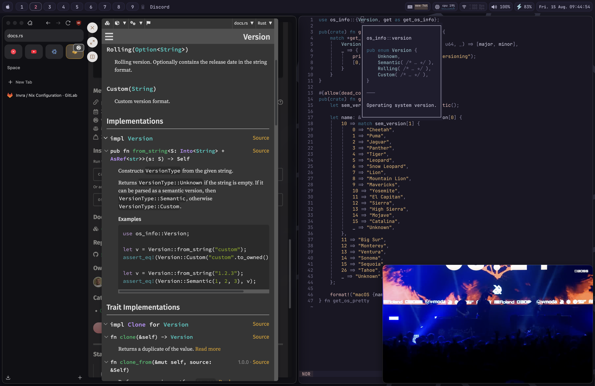

# Invra's Nix Flake.
This is a flake for NixOS, and also supports Nix-darwin! This is designed to me modular for other people to use. This <i>is</i> more for <u>advanced users</u> so if you are up for the
task to do this, this flake might be for you.

## Use
This flake is tailored for my use, it may align with yours, so here a list below.
* Open source contribution with GitLab, and GitHub
* Web Development with Bun.js
* Native programming with C, C++, Rust, Zig
* Vim centric (pretty much no mouse)
* Terminal centric (Terminal when helpful. You will find mostly no file manager)
* Minimalism where wanted, but complexity for certain tasks. (Audio patch software, advanced networking support)
* Declarative, convenient, reproducible setup (1-5 commands and your good to go to be setup)
* Networking (docker, network manager, advanced interface configs for bridging.)

## Support
* ``aarch64-darwin``
* ``x86_64-darwin``

> [!note]
> The support for ``aarch64-linux`` is planned. No date so far.

## Example
This section shows example configurations using this flake.

<details open>
<summary>NixOS - Spotify + WezTerm + Hyprland</summary>

</details>

<details>
<summary>NixOS - Vesktop + Browsing + PiP</summary>

</details>

<details>
<summary>NixOS - Neovim with Mako</summary>

</details>

<details>
<summary>Nix-darwin - Neovim + Spotify</summary>

</details>

## Making a Configuration of Your Own

It’s highly recommended to create your own configuration — this is what makes the system truly <u>*yours*</u>.

### File Structure

Your configurations should live inside the `./configurations/` directory.
You’ll find my personal configurations there as examples to follow.

Each configuration resides in a directory named after the profile, which informs the flake system of its identifier.
For example, a folder named `gary` corresponds to the following commands:

```sh
sudo nixos-rebuild switch --flake .#gary
darwin-rebuild switch --flake .#gary
home-manager rebuild switch --flake .#gary
```
