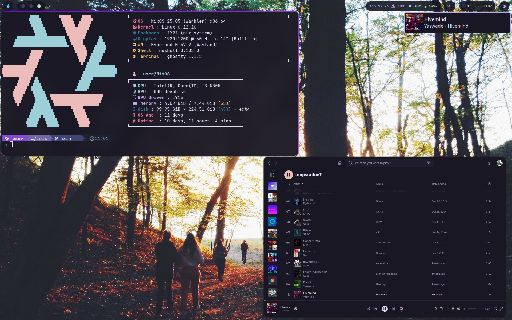
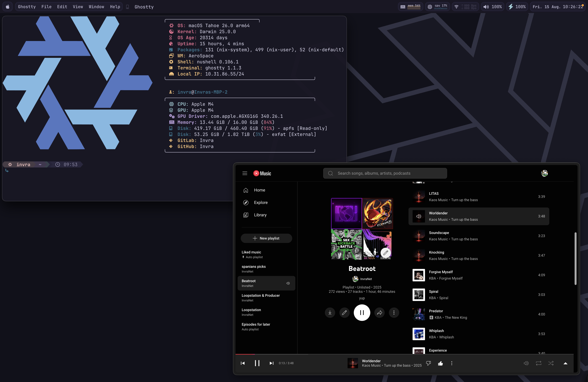
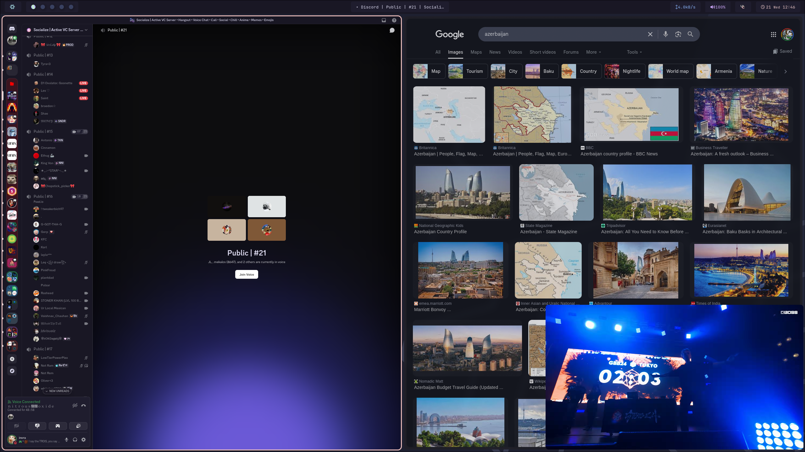

# Invra's Nix Configuration

My main operating system is NixOS, which means this flake will be updated frequently.
This system is designed to be partially modular, allowing for configuration and installation tailored to your user setup.

> \[!IMPORTANT]
> If you're a current user of this flake, note that as of commit [4352d6a8](https://gitlab.com/InvraNet/nix-conf/-/commit/4352d6a803fc61e224faf7d0b92e5bcf7ec0edc0), your config will **NOT** build unless converted to the new Nix configuration format. Please refer to the section **Making a Configuration of Your Own** for instructions.

---

## Example

This section shows example configurations using this flake.

<details open>
<summary>Spotify + Ghostty + Waybar</summary>

</details>

<details>
<summary>Development Environment</summary>

</details>

<details>
<summary>Neovim with Mako</summary>

</details>

---

## Making a Configuration of Your Own

It’s highly recommended to create your own configuration — this is what makes the system truly <u>*yours*</u>.

### File Structure

Your configurations should live inside the `./configurations/` directory.
You’ll find my personal configurations there as examples to follow.

Each configuration resides in a directory named after the profile, which informs the flake system of its identifier.
For example, a folder named `gary` corresponds to the following commands:

```sh
sudo nixos-rebuild switch --flake .#gary
darwin-rebuild switch --flake .#gary
home-manager rebuild switch --flake .#gary
```

---

## Still Using TOML?

This version of the flake has **completely removed support for TOML** configuration.
Please follow the instructions below to migrate your setup.

### Prerequisites

* Nix REPL
* Your old TOML configuration file

### Instructions

1. Open the Nix REPL:

   ```sh
   nix repl
   ```

2. Load your TOML configuration (replace `configFile.toml` with your actual filename):

   ```nix
   :p builtins.fromTOML (builtins.readFile ./configFile.toml)
   ```

3. Copy the output to your clipboard.
   Paste it into a new `.nix` file following the dynamic configuration format.

4. Place the new `.nix` file in your appropriate `./configurations/` subdirectory.
