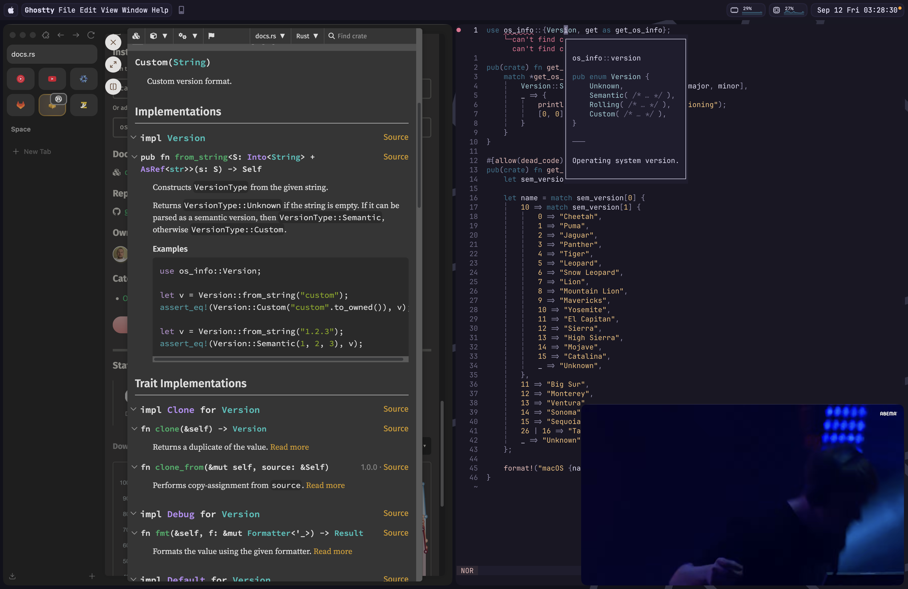

# Invra's Nix Flake

This Nix flake provides the following:

* **Home-manager config**
* **NixOS config**
* **Nix-darwin config**

### Key Features:

- **Advanced networking for virtualization** (Bridging)
- **Pro audio** (JACK2 with OOB support for Bitwig Studio)
- **Terminal-based work**:
  - Helix editor
  - spotify_player
  - git, gh, glab
  - btop

- **Zen Browser**
- **Multimedia**:
  - OBS Studio
  - yt-dlp

- **Social** (currently only Discord)
- **Remote software**:
  - Parsec
  - Remmina Connect
  - Wayvnc

### Supported Platforms:

This flake **guarantees** support for the following platforms:

* aarch64-linux
* x86_64-linux
* aarch64-darwin

> [!NOTE]
> The reason `x86_64-darwin` is not supported is that 2025 marks the last year of macOS support for the x86\_64 ISA. As a result, there will be no need to continue supporting the x86 architecture.

## Examples

This section showcases example configurations using this flake.

NixOS – Spotify + WezTerm + Hyprland

NixOS – Vesktop + Browsing + PiP

NixOS – Neovim with Mako

Nix-darwin – Neovim + Spotify

## Documentation

The full documentation is available in the [`./docs`](./docs/) directory.
