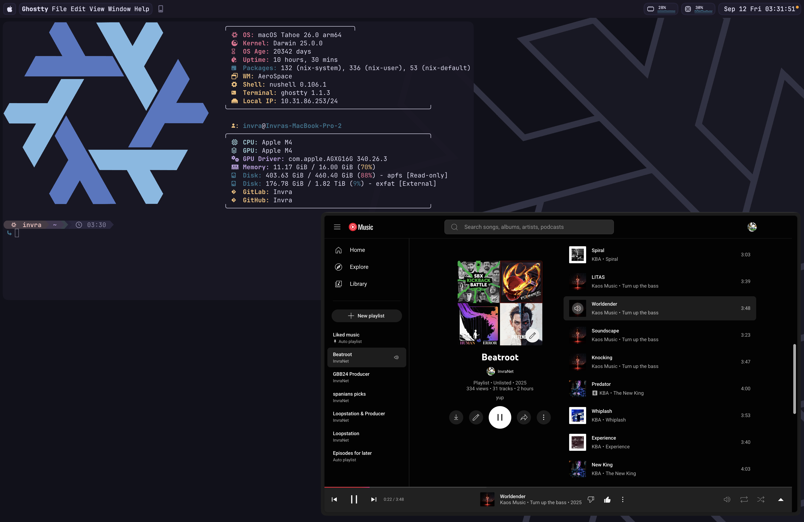

# INF (Invra's Nix Flake) Configuration Template

This Nix flake provides the following:

- **Home-manager config**
- **NixOS config**
- **Nix-darwin config**

### Key Features:

- **Advanced networking for virtualization** (Bridging)
- **Pro audio** (JACK2 with OOB support for Bitwig Studio)
- **Terminal-based work**:
  - helix
  - spotify_player
  - git, gh, glab
  - btop

- **Multimedia**:
  - zen-browser
  - chromium
  - OBS Studio
  - yt-dlp
  - discord **(vesktop for linux-aarch64)**

- **Remote software**:
  - Parsec
  - Wayvnc

- **OOB Configurations**:
  - Rose-pine theme for congruency
  - Discord settings for optimal + sensical usage
  - Lower change of PulseAudio to earrape you
  - (Mac) Apps are installed to make "the Mac experience" make more sense
    * Linear Mouse
    * Raycast
    * AeroSpace

### Supported Platforms:

This flake can usually **guarantee** support for the following platforms:

- aarch64-linux
- x86_64-linux
- aarch64-darwin

> [!NOTE]
> `x86_64-darwin` has no view to guarantee support due to a few certain issues
> like software support and also 26 Tahoe marks the end of x86 architechture on
> macOS. This decision will only be subject to change if the Main Maintaner (Invra)
> were to get an x86 MacBook. Which is highly unlikely by forseeing the future of x86.

## Examples

This section showcases example configurations using this flake.

NixOS – Spotify + WezTerm + Hyprland

Nix-darwin – Spotify + Ghostty

NixOS – Vesktop + Browsing + PiP

Nix-darwin – Helix - Rust Dev + Browsing - Reading Docs + PiP

NixOS – Neovim + Mako

## Documentation

The full documentation is available in the [`./docs`](./docs/) directory.
